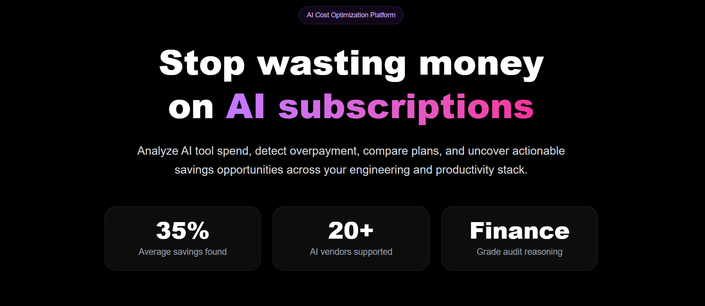
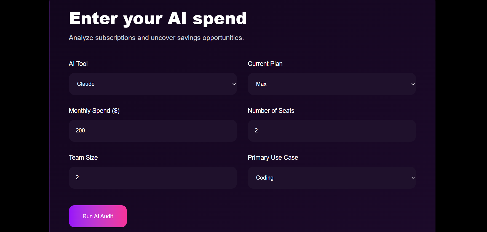
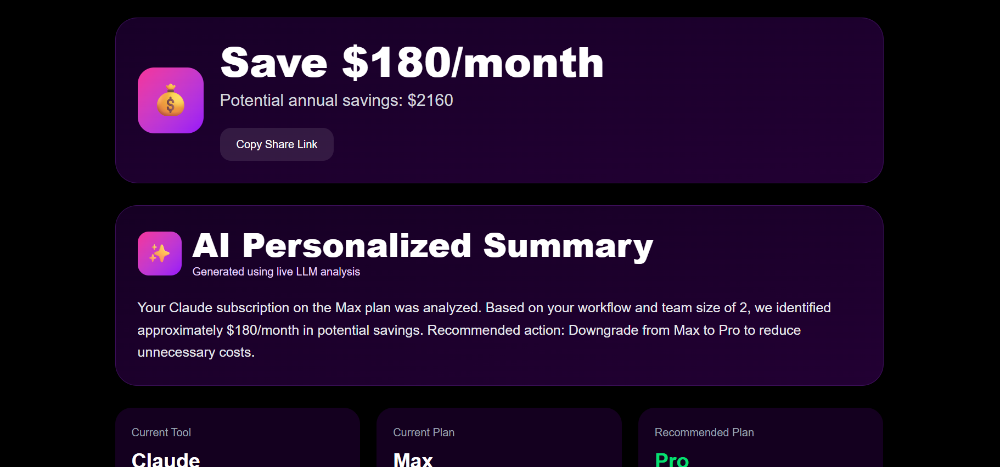
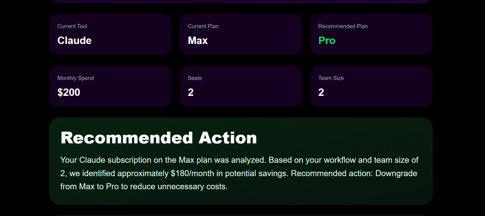
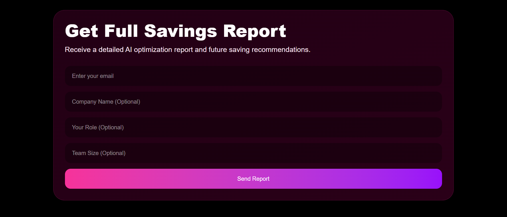

# AI Spend Audit

AI Spend Audit is a SaaS-style web application that analyzes AI tool subscriptions and identifies cost-saving opportunities for startups and teams. Users can enter their current AI stack usage and instantly receive personalized recommendations, projected savings, and a shareable audit report.

The tool is designed for founders, developers, and small teams who want visibility into unnecessary AI subscription costs across tools like ChatGPT, Claude, Cursor, Gemini, and GitHub Copilot.

## Live Demo

https://ai-spend-audit-rho-one.vercel.app

## Features

* AI spend analysis
* Personalized optimization recommendations
* Estimated monthly + annual savings
* Shareable public result URLs
* Firebase persistence
* Open Graph sharing support
* Lead capture form
* Responsive UI
* Automated tests
* GitHub Actions CI

## Screenshots

Example:

* Homepage
* Audit form
* Results page

## Quick Start

### Install

npm install

### Run locally

npm run dev

### Run tests

npx vitest run

### Deploy

Deploy easily with Vercel.

Required environment variables:

NEXT_PUBLIC_FIREBASE_API_KEY=

NEXT_PUBLIC_FIREBASE_AUTH_DOMAIN=

NEXT_PUBLIC_FIREBASE_PROJECT_ID=

NEXT_PUBLIC_FIREBASE_STORAGE_BUCKET=

NEXT_PUBLIC_FIREBASE_MESSAGING_SENDER_ID=

NEXT_PUBLIC_FIREBASE_APP_ID=

FIREBASE_CLIENT_EMAIL=

FIREBASE_PRIVATE_KEY=

OPENROUTER_API_KEY=

RESEND_API_KEY=

NEXT_PUBLIC_BASE_URL=

## Decisions / Trade-offs

### 1. Firebase instead of a SQL database

Firebase allowed faster iteration and simplified deployment while still supporting public audit URLs and lead persistence.

### 2. Rule-based audit engine instead of fully AI-generated recommendations

I prioritized deterministic and testable outputs over fully dynamic LLM reasoning to ensure reliable savings calculations.

### 3. Next.js App Router

I used the App Router for dynamic route support, metadata generation, and server-side APIs in a single framework.

### 4. Public share pages without authentication

This improves virality and reduces friction, though it sacrifices some privacy controls.

### 5. Tailwind CSS over component-heavy UI frameworks

Tailwind allowed rapid iteration and lightweight styling without depending heavily on prebuilt templates.
